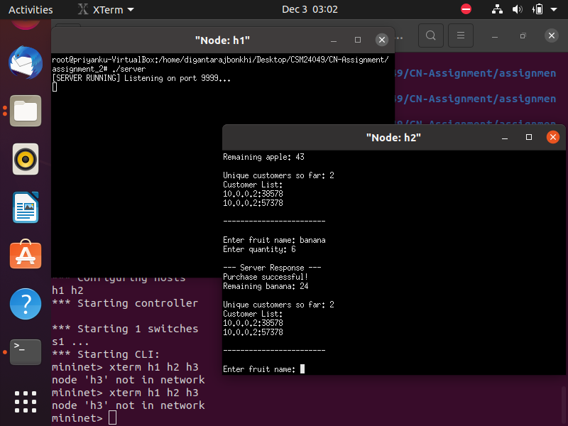

---

# 🍎 Fruit Inventory Client–Server Application (C++ & Mininet)

## 📌 Overview

This project implements a **TCP-based client–server application** using **C++ socket programming**.
The system simulates a **Fruit Inventory Server** where multiple clients can connect concurrently, purchase fruits, and receive real-time inventory updates.

The server maintains:

* Available fruits and quantities
* Last sold quantity and timestamp
* A list of **unique customers** (identified by IP:Port)

The client allows users to:

* Connect to the server
* Request fruit purchases
* View server responses dynamically

---

## 🛠️ Technologies Used

* **Programming Language:** C++
* **Networking:** TCP/IP (Sockets)
* **Concurrency:** Multithreading (`std::thread`)
* **Synchronization:** Mutex (`std::mutex`)
* **Platform:** Linux / Mininet

---

## 📂 Project Structure

```
Fruit-Inventory-System/
│
├── client.cpp        # Client-side program
├── server.cpp        # Server-side program
├── README.md         # Project documentation
└── output.png        # Screenshot of program output
```

---

## ⚙️ How It Works

### Server Side

* Listens on **port 9999**
* Accepts multiple client connections
* Handles each client in a **separate thread**
* Updates shared fruit inventory safely using a mutex
* Tracks unique customers by `<IP:Port>`

### Client Side

* Connects to server using server IP (e.g., `10.0.0.1` in Mininet)
* Sends requests in the format:

  ```
  fruit_name,quantity
  ```
* Displays server response including:

  * Purchase status
  * Remaining stock
  * Number of unique customers

---

## 🚀 Compilation & Execution

### Compile Server

```bash
g++ server.cpp -o server -pthread
```

### Compile Client

```bash
g++ client.cpp -o client
```

### Run Server (on Mininet host / terminal)

```bash
./server
```

### Run Client

```bash
./client
```

> ⚠️ Make sure the **IP address in client.cpp** matches the server’s Mininet host IP (e.g., `10.0.0.1`).

---

## 🧪 Sample Input

```
Enter fruit name: apple
Enter quantity: 5
```

---

## 📤 Sample Output

```
--- Server Response ---
Purchase successful!
Remaining apple: 45

Unique customers so far: 1
Customer List:
10.0.0.2:45321
------------------------
```

---

## 🖼️ Output Screenshot

> Add your program output screenshot here
> (Take a screenshot while running client & server)

```
📁 Ass2.png
```

**Example (Markdown syntax):**

```md

```

⬆️ Paste this line in the README after adding `output.png` to the folder.

---

## ✨ Features

* Multi-client support
* Thread-safe shared inventory
* Real-time inventory updates
* Unique customer tracking
* Clean client–server separation

---

## 📚 Learning Outcomes

* Understanding TCP socket programming
* Handling concurrency in C++
* Synchronization using mutex
* Client–server communication in Mininet
* Practical networking application design

---

## 👨‍💻 Author

**Arijit**
Department of Computer Science
(For CN / Networking Lab Assignment)


